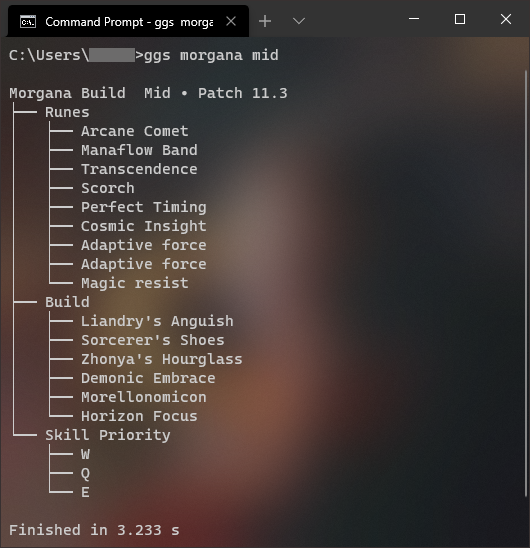

# gg-scrape

A little Python CLI app that provides a League champion runes/build from mobalytics.gg and the recommended skill order from champion.gg
The goal was to not have to open a browser tab to check a build.

```
Usage: ggs.py [OPTIONS] CHAMPION [ROLE]
```




Depends on the anytree, beautifulsoup4, typer, and requests Python libraries.
The HTML is requested and parsed sequentially, so it's rather slow.
