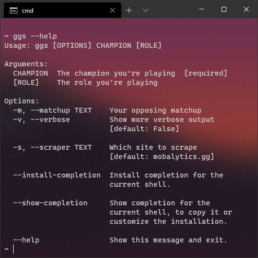
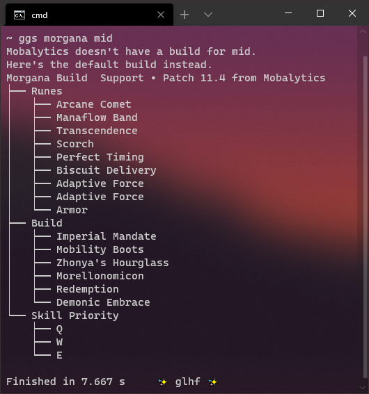
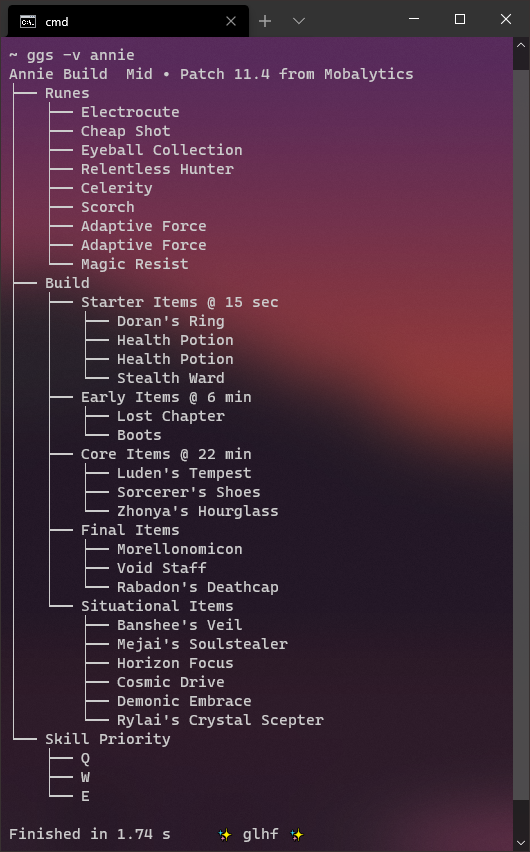

# gg-scrape
[](https://mperlet.github.io/pybadge/)
[](https://github.com/psf/black)

A little Python CLI app that provides a League of Legends champion build by scraping the web.

The goal was to not have to open a browser tab (or be advertised to) to quickly check a build before a match.
The HTML is requested and parsed sequentially, so it's somewhat slow (but still faster than opening a browser, probably).

Note: this is a hobby project and not actively maintained, nor guaranteed to work 🤞

## Installation
```
python -m pip install gg-scrape --user
```

## Usage
```
ggs [OPTIONS] CHAMPION [ROLE]
```

Sites that are currently (mostly) supported:
 - [Champion.gg](https://champion.gg)
 - [Mobalytics.gg](https://app.mobalytics.gg)
 - [Lolalytics.com](https://lolalytics.com/)


## Screenshots





## Requirements
Depends on the anytree, beautifulsoup4, pyppeteer, Typer, and requests Python libraries.

## Contributions
Thanks to [@Mycsina](https://github.com/Mycsina) for feedback and helping to improve and expand this package's functionality!

Pull requests are welcome! 
